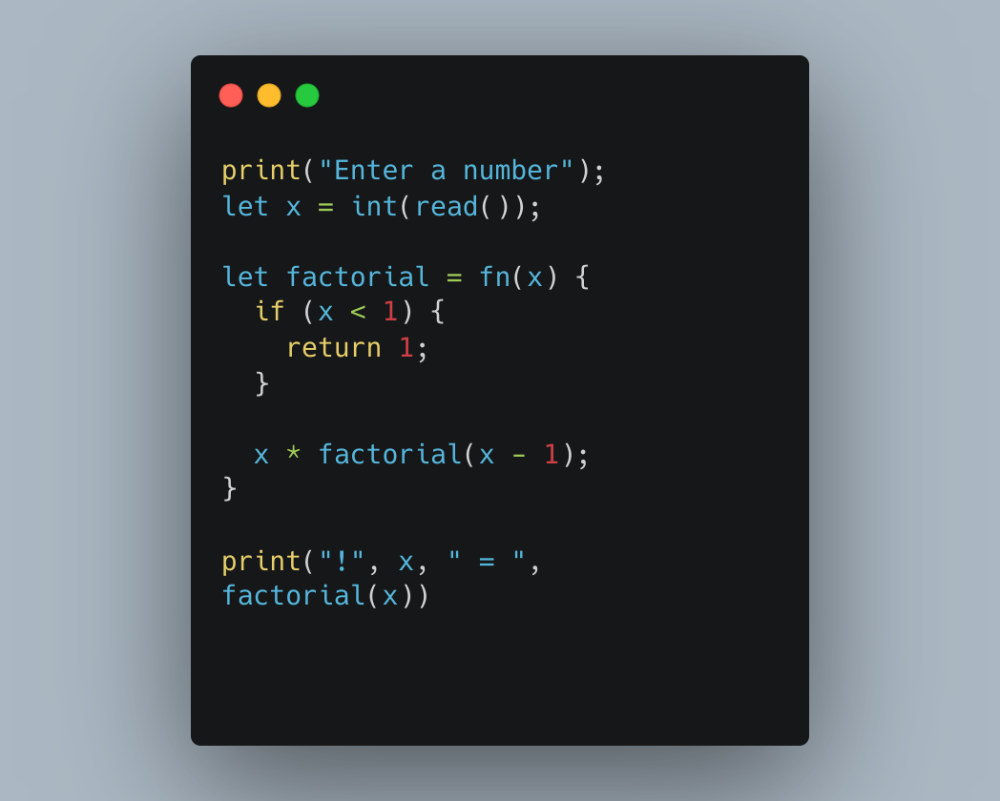

# Cube Programming Language

<p align="center">
  
</p>

Cube is a simple custom interpreted programming language implemented in Go, following the principles outlined in the book "Writing an Interpreter in Go" by Thorsten Ball. This project was designed to help me deeper understanding how interpreters work.

## Getting Started

### Prerequisites
Before you begin, make sure you have Go installed on your system. You can download and install Go from the [official website](https://golang.org/dl/).

### Installation
Clone this repository to your local machine using:

```shell
git clone https://github.com/AzraelSec/cube.git
```

Change your current directory to the Cube project folder:

```shell
cd cube
```

### Building the Interpreter
To build the Cube interpreter, run the following command:

```shell
make
```

This will generate two executables:

- `repl`: A REPL interpreter to test the language instructions.
- `cube`: A file content interpreter.

## Usage

To run a Cube program, use the following command:

```shell
./cube filename.cb
```

Replace `filename.cb` with the path to the Cube script you want to execute.

## Syntax

Cube has a simple and minimalistic syntax. Here are some basic features of the language:

- Variables: Cube supports variable assignment and usage.
- Arithmetic Operations: You can perform basic arithmetic operations (addition, subtraction, multiplication, division) in Cube.
- Basic string manipulation: Cube supports strings comparison and basic concatenation using the `==` and `+` operators.
- I/O builtins: You can use the `print` and `read` statement to display and read from console.
- Conditional Statements: Cube supports `if` and `if/else` statements for basic conditional logic.
- Functions and closures: Functions are first-class citizens in Cube, so you can assign them to variables, pass them to other functions, etc.

For a more detailed description of the language syntax, refer to the code and comments in the Cube interpreter source files.

## Examples

Here's a simple Cube program that calculates the factorial of a given number and prints the result:

<p align="center">
  
</p>

To run this program, save it to a file with the `.cb` extension and execute it using the Cube interpreter.
